# 🌌 Welcome to My Digital Universe

<div align="center">

<!-- Animated Banner with Complex SVG -->


<!-- Advanced Typing Animation -->


</div>

---

<div align="center">

## 🎭 About Me - The Digital Alchemist


</div>

```yaml
name: "Your Name"
role: "Full Stack Developer"
location: "🌍 Earth"
code: ["JavaScript", "Python", "TypeScript", "Go", "Rust"]
specialties: 
  - "🎨 Frontend Wizardry"
  - "⚡ Backend Sorcery" 
  - "☁️ Cloud Architecture"
  - "🤖 AI Integration"
current_focus: "Building the future, one commit at a time"
motto: "Code is poetry written for machines to understand"
```

<div align="center">

<!-- Advanced GitHub Stats with Animation -->


</div>

---

## 🛠️ Tech Arsenal - My Digital Weapons

<div align="center">

<!-- Animated Technology Icons -->


</div>

### 🔥 Advanced Skills Matrix

<table align="center">
<tr>
<td align="center" width="96">

<br><strong>React</strong>
<br>⭐⭐⭐⭐⭐
</td>
<td align="center" width="96">

<br><strong>Node.js</strong>
<br>⭐⭐⭐⭐⭐
</td>
<td align="center" width="96">

<br><strong>Python</strong>
<br>⭐⭐⭐⭐⭐
</td>
<td align="center" width="96">

<br><strong>Docker</strong>
<br>⭐⭐⭐⭐⭐
</td>
<td align="center" width="96">

<br><strong>AWS</strong>
<br>⭐⭐⭐⭐⭐
</td>
</tr>
<tr>
<td align="center" width="96">

<br><strong>TypeScript</strong>
<br>⭐⭐⭐⭐⭐
</td>
<td align="center" width="96">

<br><strong>Go</strong>
<br>⭐⭐⭐⭐
</td>
<td align="center" width="96">

<br><strong>Rust</strong>
<br>⭐⭐⭐⭐
</td>
<td align="center" width="96">

<br><strong>K8s</strong>
<br>⭐⭐⭐⭐
</td>
<td align="center" width="96">

<br><strong>GraphQL</strong>
<br>⭐⭐⭐⭐
</td>
</tr>
</table>

---

## 📊 GitHub Analytics - The Numbers Game

<div align="center">

<!-- Complex GitHub Activity Graph -->


</div>

<div align="center">
<details>
<summary>🔍 <strong>Detailed GitHub Metrics</strong> (Click to expand)</summary>
<br>

<!-- Advanced Metrics -->


<br><br>

<!-- Trophies Animation -->


</details>
</div>

---

## 🚀 Featured Projects - Digital Masterpieces

## <div align="center">

## <!-- Project Cards with Advanced Styling -->
## <a href="https://github.com/yourusername/project1">
##  
## </a>
## <a href="https://github.com/yourusername/project2">
##   
## </a>

## </div>

### 💼 Project Showcase

<table>
<tr>
<td width="50%">
<h4>🌟 <a href="#">Project Alpha</a></h4>
<p><strong>Tech Stack:</strong> React, Node.js, PostgreSQL, Docker</p>
<p>Revolutionary web application that transforms user experience through AI-powered recommendations and real-time analytics.</p>
<p>
  
  
  
</p>
</td>
<td width="50%">
<h4>🔥 <a href="#">Project Beta</a></h4>
<p><strong>Tech Stack:</strong> Python, FastAPI, MongoDB, Kubernetes</p>
<p>High-performance microservices architecture handling millions of requests with machine learning integration.</p>
<p>
  
  
  
</p>
</td>
</tr>
</table>

---

## 🎯 Current Focus & Goals

```mermaid
graph TD
    A[🎯 2024 Goals] --> B[🚀 Open Source Contributions]
    A --> C[📚 Learning Advanced AI/ML]
    A --> D[🌐 Building Scalable Systems]
    A --> E[🤝 Community Engagement]
    
    B --> F[Contribute to 50+ repos]
    C --> G[Master TensorFlow & PyTorch]
    D --> H[Kubernetes & Cloud Native]
    E --> I[Tech Talks & Mentoring]
    
    style A fill:#00D8FF,stroke:#333,stroke-width:3px,color:#000
    style B fill:#FF6B35,stroke:#333,stroke-width:2px,color:#fff
    style C fill:#4ECDC4,stroke:#333,stroke-width:2px,color:#000
    style D fill:#45B7D1,stroke:#333,stroke-width:2px,color:#fff
    style E fill:#96CEB4,stroke:#333,stroke-width:2px,color:#000
```

<div align="center">



</div>

---

## 📈 Coding Activity - The Grind Never Stops

<div align="center">

<!-- WakaTime Stats -->


</div>

### ⏰ Weekly Development Breakdown

```text
💻 Programming Languages:
JavaScript   12 hrs 30 mins  ████████████░░░░░░░░░   60.2%
Python       4 hrs 15 mins   ████░░░░░░░░░░░░░░░░░   20.5%
TypeScript   2 hrs 45 mins   ██░░░░░░░░░░░░░░░░░░░   13.2%
Go           1 hr 20 mins    ░░░░░░░░░░░░░░░░░░░░░    6.1%

🔧 Development Tools:
VS Code      15 hrs 30 mins  ███████████████░░░░░░   74.8%
Terminal     3 hrs 45 mins   ████░░░░░░░░░░░░░░░░░   18.1%
Browser      1 hr 30 mins    ██░░░░░░░░░░░░░░░░░░░    7.1%
```

---

## 🌐 Connect & Collaborate

<div align="center">

<!-- Animated Social Links -->
<a href="https://linkedin.com/in/yourprofile" target="_blank">
  
</a>
<a href="https://twitter.com/yourhandle" target="_blank">
  
</a>
<a href="mailto:your.email@domain.com" target="_blank">
  
</a>
<a href="https://yourwebsite.com" target="_blank">
  
</a>
<a href="https://dev.to/yourprofile" target="_blank">
  
</a>

<br><br>

<!-- Visitor Counter with Animation -->


</div>

---

## 💭 Philosophy & Quotes

<div align="center">

> *"The best error message is the one that never shows up."*
> 
> *"Code is like humor. When you have to explain it, it's bad."*
> 
> *"Any fool can write code that a computer can understand. Good programmers write code that humans can understand."*

</div>

---

## 🎮 Fun Facts & Easter Eggs

<details>
<summary>🎯 <strong>Click to reveal some fun facts about me!</strong></summary>
<br>

- 🎸 I play guitar and compose music in my spare time
- 🎮 Gaming enthusiast - currently playing Cyberpunk 2077
- 📚 I've read over 50 programming books this year
- ☕ Coffee consumption: ~4 cups per day (debugging fuel)
- 🌱 I'm learning Japanese (現在日本語を勉強しています)
- 🏃‍♂️ Marathon runner - completed 3 marathons so far
- 🎨 I create digital art using AI tools
- 🧩 Rubik's cube solver - personal best: 1 minute 23 seconds
- 🚀 Space exploration enthusiast
- 🎯 I can solve coding problems while listening to death metal

</details>

---

## 📊 Advanced GitHub Metrics

<div align="center">

<!-- Complex Stats Grid -->


</div>

---

<div align="center">

<!-- Animated Footer -->


<!-- Snake Animation -->
<picture>
  <source media="(prefers-color-scheme: dark)" srcset="https://raw.githubusercontent.com/yourusername/yourusername/output/github-contribution-grid-snake-dark.svg">
  <source media="(prefers-color-scheme: light)" srcset="https://raw.githubusercontent.com/yourusername/yourusername/output/github-contribution-grid-snake.svg">
  
</picture>

<h3>💻 "Code is the closest thing we have to magic" ✨</h3>

</div>

<!-- Hidden ASCII Art (for those who view source) -->
<!--
⠀⠀⠀⠀⠀⠀⠀⠀⠀⠀⠀⣠⣤⣤⣤⣤⣤⣶⣦⣤⣄⡀⠀⠀⠀⠀⠀⠀⠀⠀
⠀⠀⠀⠀⠀⠀⠀⠀⢀⣴⣿⡿⠛⠉⠙⠛⠛⠛⠛⠻⢿⣿⣷⣤⡀⠀⠀⠀⠀⠀
⠀⠀⠀⠀⠀⠀⠀⠀⣼⣿⠋⠀⠀⠀⠀⠀⠀⠀⢀⣀⣀⠈⢻⣿⣿⡄⠀⠀⠀⠀
⠀⠀⠀⠀⠀⠀⠀⣸⣿⡏⠀⠀⠀⣠⣶⣾⣿⣿⣿⠿⠿⠿⢿⣿⣿⣿⣄⠀⠀⠀
⠀⠀⠀⠀⠀⠀⠀⣿⣿⠁⠀⠀⢰⣿⣿⣯⠁⠀⠀⠀⠀⠀⠀⠀⠈⠙⢿⣷⡄⠀
⠀⠀⣀⣤⣴⣶⣶⣿⡟⠀⠀⠀⢸⣿⣿⣿⣆⠀⠀⠀⠀⠀⠀⠀⠀⠀⠀⣿⣷⠀
⠀⢰⣿⡟⠋⠉⣹⣿⡇⠀⠀⠀⠘⣿⣿⣿⣿⣷⣦⣤⣤⣤⣶⣶⣶⣶⣿⣿⣿⠀
⠀⢸⣿⡇⠀⠀⣿⣿⡇⠀⠀⠀⠀⠹⣿⣿⣿⣿⣿⣿⣿⣿⣿⣿⣿⣿⣿⡿⠃⠀
⠀⣸⣿⡇⠀⠀⣿⣿⡇⠀⠀⠀⠀⠀⠉⠻⠿⣿⣿⣿⣿⡿⠿⠿⠛⢻⣿⡇⠀⠀
⠀⣿⣿⠁⠀⠀⣿⣿⡇⠀⠀⠀⠀⠀⠀⠀⠀⠀⠀⠀⠀⠀⠀⠀⠀⢸⣿⣧⠀⠀
⠀⣿⣿⠀⠀⠀⣿⣿⡇⠀⠀⠀⠀⠀⠀⠀⠀⠀⠀⠀⠀⠀⠀⠀⠀⢸⣿⣿⠀⠀
⠀⣿⣿⠀⠀⠀⣿⣿⡇⠀⠀⠀⠀⠀⠀⠀⠀⠀⠀⠀⠀⠀⠀⠀⠀⢸⣿⣿⠀⠀
⠀⢿⣿⡆⠀⠀⣿⣿⡇⠀⠀⠀⠀⠀⠀⠀⠀⠀⠀⠀⠀⠀⠀⠀⠀⢸⣿⡇⠀⠀
⠀⠸⣿⣧⡀⠀⣿⣿⡇⠀⠀⠀⠀⠀⠀⠀⠀⠀⠀⠀⠀⠀⠀⠀⠀⣿⣿⠃⠀⠀
⠀⠀⠛⢿⣿⣿⣿⣿⣇⠀⠀⠀⠀⠀⣰⣿⣿⣷⣶⣶⣶⣶⠶⠀⢠⣿⣿⠀⠀⠀
⠀⠀⠀⠀⠀⠀⠀⣿⣿⠀⠀⠀⠀⠀⣿⣿⡇⠀⣽⣿⡏⠁⠀⠀⢸⣿⡇⠀⠀⠀
⠀⠀⠀⠀⠀⠀⠀⣿⣿⠀⠀⠀⠀⠀⣿⣿⡇⠀⢹⣿⡆⠀⠀⠀⣸⣿⠇⠀⠀⠀
⠀⠀⠀⠀⠀⠀⠀⢿⣿⣦⣄⣀⣠⣴⣿⣿⠁⠀⠈⠻⣿⣿⣿⣿⡿⠏⠀⠀⠀⠀
⠀⠀⠀⠀⠀⠀⠀⠈⠛⠻⠿⠿⠿⠿⠋⠁⠀⠀⠀⠀⠀⠀⠀⠀⠀⠀⠀⠀⠀⠀

    Thanks for checking out my profile! 
    Remember to replace 'yourusername' with your actual GitHub username
    and customize all the personal information to match your profile.
-->
